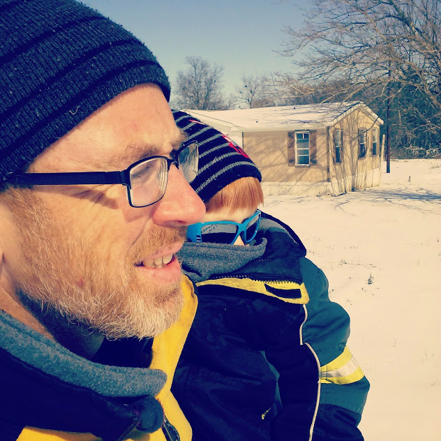

>Team-Oriented, Highly-Motivated, Freshly-Minted Programmer ready to take on the challenge of engineering dynamic solutions to the World's problems.

I have always been above-par at most things I attempt.  However, the dynamics of programming have proven to be an exceptional challenge.  The sheer volume of subject matter in this field is astounding, for which one has to keep pace with the almost daily changes of the development environment, definitely becomes a daunting task.

With what started as a hobby--turned passion, is occasionally intimidating, yet powerfully and profoundly rewarding, especially for someone such as myself, who is unrelenting in the pursuit of solutions, answers, and knowledge.

The pride I take in my work and the satisfaction of solving the unsolvable evinces a feeling, when experienced, is transcendent.  It drives me to work on more complex and robust projects.

Although I am just starting out, late in life at that, I know to be truly good at programming, I have to make it my life, programming has to be a daily task, and I would do it for free--this is how much I love doing it, however society dictates I take care of my family, thus here I am, reaching out to the tech community for a chance to make a difference.

