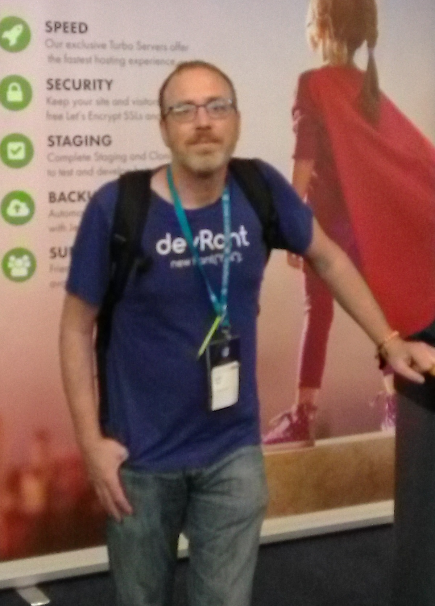

<figcaption>WordcampEU 2018, Belgrade, Serbia</figcaption>

>Team-Oriented, Highly-Motivated, Experienced Programmer ready to take on the challenge of engineering dynamic solutions to the World's problems.

  

With what started as a hobby--turned passion, is occasionally intimidating, yet powerfully and profoundly rewarding, especially for someone such as myself, who is unrelenting in the pursuit of solutions, answers, and knowledge.

After 4 years of education, I started coding professionally over 4 years ago, expanding my experience and knowledge exponentially. I am currently an intermediate dev for a very large journal Manufacturer, developing and running 30+ websites in Magento 2. I am still extremely passionate about programming, I still take online university courses and continue to excel in a very complex and logic-based environment. At 40 I have found my niche.

I love programming, to me it isn't hyperbol or jumping on the band wagon, I absolutely love solving puzzles in a logical and creative fashion. Programming is art, it is an amazing expression of one's internal thoughts and creative talent.

Like Chess, programming requires one to think 5-10 moves ahead, to ensure all the pieces fit together. It is a difficult task, to continually stay ahead of the massively complex puzzle forming out of one's mind and again, like Chess, the satisfaction of solving the unsolvable evinces a feeling, when experienced, is transcendent.  It drives me to work on more complex and robust projects.

I take extreme pride in my abilities and extreme satisfaction in the end product. I am driven, always learning, and always ready to take on a new challenge.
